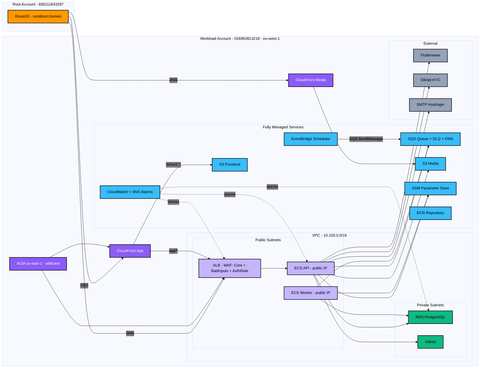
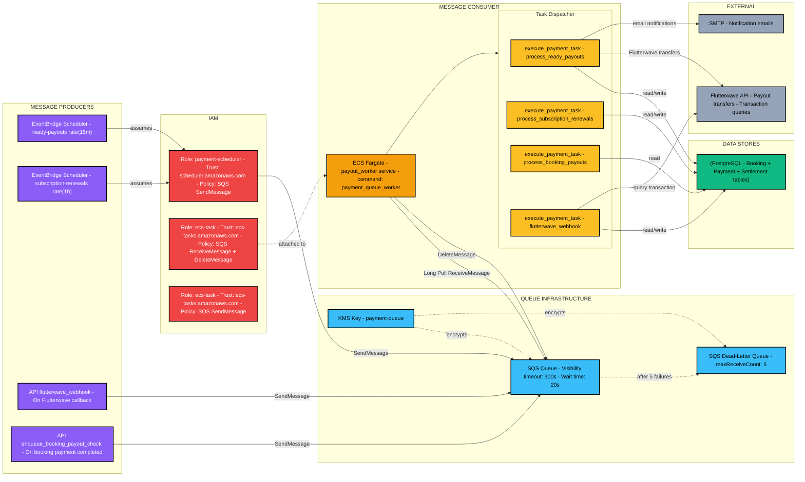
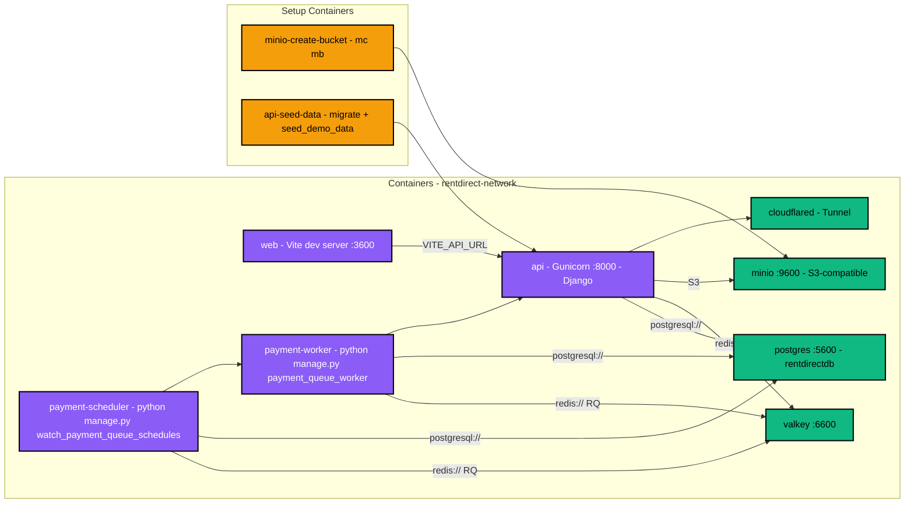
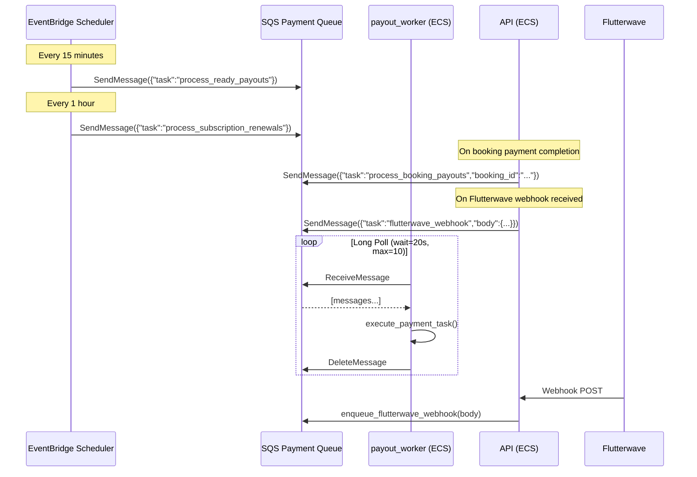
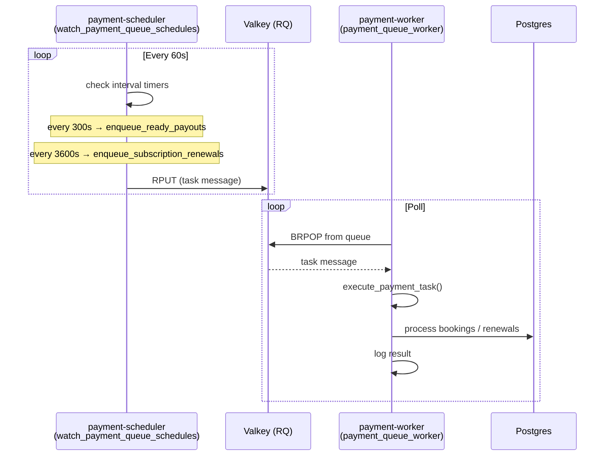

# RentDirect Architectural Review and Recommendations

Reviewed on: 2026-07-25

## Scope

This document captures an architectural review of the RentDirect repository against industry best practices for:

1. Security
2. Cost
3. Performance
4. Lowest latency
5. Fault tolerance
6. High availability

Reviewed areas include:

- `apps/api/` — Django REST Framework backend
- `apps/web/` — Vite + React frontend
- `apps/worker/` — background job placeholder
- `packages/` — shared package placeholders
- `infra/terraform/` — AWS infrastructure (ECS, RDS, Valkey, S3, CloudFront, ALB, SQS, EventBridge Scheduler, WAF, Monitoring)
- `infra/scripts/` — deploy, bootstrap, and migration scripts
- `infra/docker-compose.yml` — local development stack (including payment-worker, payment-scheduler)
- `docs/cloud_deployment_cost_estimate.md` — existing cost analysis

These are planning recommendations, not a commitment to implement every item. Priorities are grouped by impact and maturity stage at the end of this document.

---

## Current Architecture

RentDirect is a rental marketplace monorepo deployed on AWS in `eu-west-1`:

| Layer | Technology |
|-------|------------|
| Frontend | Vite 5 + React 18 + TypeScript + Tailwind, static build on S3 |
| API | Django 5.1 + DRF + JWT cookies, Gunicorn on ECS Fargate (ARM64) |
| Payout Worker | Django management command (`payment_queue_worker`), separate ECS Fargate task (ARM64) |
| Database | RDS PostgreSQL 18.1 (gp3, encrypted, private subnets) |
| Cache | ElastiCache Valkey (`cache.t4g.micro`, transit encryption enabled) |
| Storage | S3 (frontend + media buckets), CloudFront OAC |
| Edge | CloudFront (app + media distributions), Route53, ACM |
| Load balancing | Public ALB (TLS 1.3) |
| Payment Queue | SQS (FIFO-like via separate queue), KMS encrypted |
| Scheduler | EventBridge Scheduler (ready-payouts every 15min, subscription-renewals every 1hr) |
| Secrets | SSM Parameter Store + age-encrypted local env files |
| IaC | Terraform workspaces (`dev` / `prod`) |
| CI/CD | Manual scripts (`make deploy`); no GitHub Actions workflows yet |
| WAF | AWS WAF (Common Rule Set, Known Bad Inputs, auth rate limit on ALB/CloudFront) |
| Monitoring | CloudWatch alarms (ALB 5xx, ECS task count, RDS CPU) → SNS → Email |

### Environment sizing (prod)

| Component | Configuration |
|-----------|---------------|
| API ECS | 1024 CPU / 2048 MB, 2–4 tasks, CPU autoscaling at 70% |
| Payout Worker ECS | 256 CPU / 512 MB, 1 task |
| RDS | `db.t4g.small`, 20 GB gp3 (max 500 GB), 7-day backups, `multi_az = false` |
| Valkey | `cache.t4g.micro`, engine 9.0, `replica_count = 0`, transit encryption enabled |
| CloudFront | PriceClass_100, HTTP/2 + HTTP/3, WAF attached |
| Container Insights | Disabled |
| RDS Proxy | Enabled in prod |
| Performance Insights | Enabled in prod (7-day retention) |

### Traffic flow

```text
Browser
  ├─ HTTPS → CloudFront (rentdirect.homes) → S3 frontend bucket
  ├─ HTTPS → CloudFront (/api/*) → ALB → ECS Fargate :8000
  ├─ HTTPS → api.rentdirect.homes → ALB → ECS Fargate :8000
  └─ HTTPS → media.rentdirect.homes → CloudFront → S3 media bucket

ECS Fargate (API + Worker)
  ├─ RDS PostgreSQL (private subnets, SSL required)
  ├─ ElastiCache Valkey (private subnets, transit encryption)
  ├─ S3 media bucket (upload via django-storages)
  └─ SQS Payment Queue (send + receive messages)

EventBridge Scheduler
  └─ SQS Payment Queue (every 15min / every 1hr)

Flutterwave (external)
  └─ HTTPS Webhook → ECS API (via ALB)
```

### Architecture diagram — AWS service view

This diagram shows the complete AWS topology with every service, its interactions, and dependency direction. Arrow direction = data/control flow. Dashed lines = monitoring/metrics.

```mermaid
flowchart TB
  subgraph clients["CLIENTS"]
    Browser["Browser SPA"]
    Flutterwave["Flutterwave Payment Gateway"]
  end

  subgraph edge["EDGE LAYER - eu-west-1"]
    R53["R53 Route53 - rentdirect.homes"]
    ACM["ACM Certificate Manager - Wildcard"]
    CFWeb["CF CloudFront - App Distribution"]
    CFMedia["CF CloudFront - Media Distribution"]
  end

  subgraph waf["SECURITY - AWS WAF"]
    WAF_CF["WAF Web ACL CloudFront - Rule: Core Set"]
    WAF_ALB["WAF Web ACL Regional - Rules: Core + BadInputs + AuthRate"]
  end

  subgraph network["VPC - 10.100.0.0/16"]
    direction TB
    subgraph public_subnets["Public Subnets x 2 AZ"]
      ALB["ALB Application Load Balancer - TLS 1.3"]
    end
    subgraph private_subnets["Private Subnets x 2 AZ"]
      RDS["RDS PostgreSQL 18.1 - db.t4g.small - Multi-AZ: false"]
      Valkey["EC ElastiCache Valkey 9.0 - cache.t4g.micro"]
    end
  end

  subgraph compute["ECS Fargate - Public Subnets"]
    ECSCluster["ECS Cluster"]
    subgraph svc_api["ECS Service: api"]
      ApiTask["Fargate Task - 1024 CPU / 2048 MB - Gunicorn"]
    end
    subgraph svc_worker["ECS Service: payout-worker"]
      WorkerTask["Fargate Task - 256 CPU / 512 MB - payment_queue_worker"]
    end
  end

  subgraph messaging["MESSAGING"]
    SQS["SQS / Payment Queue - KMS Encrypted - Visibility: 300s"]
    SQSDLQ["SQS / Payment DLQ - KMS Encrypted - maxReceive: 5"]
    KMS["KMS / Key - payment-queue - Rotation: on"]
  end

  subgraph scheduler["SCHEDULER"]
    EB["EventBridge Scheduler"]
    SchedReady["Schedule: ready-payouts - rate(15 min)"]
    SchedRenew["Schedule: subscription-renewals - rate(1 hour)"]
    SchedRole["IAM Role - scheduler.amazonaws.com - SQS SendMessage"]
  end

  subgraph storage["STORAGE"]
    S3Front["S3 / Frontend Bucket - SSE, Versioned, OAC"]
    S3Media["S3 / Media Bucket - SSE, Versioned, OAC"]
    ECR["ECR / API Repository - rentdirect/api"]
  end

  subgraph secrets["SECRETS & CONFIG"]
    SSM["SSM / Parameter Store - SecureString secrets"]
  end

  subgraph monitoring["MONITORING"]
    CW["CloudWatch - Log Groups + Metrics"]
    SNS["SNS / Topic - alarms@rentdirect.homes"]
    PI["RDS Performance Insights - 7-day retention"]
    RDSProxy["RDS Proxy - Connection pooling"]
  end

  subgraph external["EXTERNAL"]
    FW["Flutterwave v4 API"]
    Email["SMTP / Hostinger Email"]
    Dikript["Dikript KYC API"]
  end

  %% Flow: Browser → DNS → Edge → Origin
  Browser -->|HTTPS| CFWeb
  Browser -->|HTTPS media.*| CFMedia
  Browser -->|HTTPS api.*| ALB
  R53 -->|A / AAAA alias| CFWeb
  R53 -->|A / AAAA alias| CFMedia
  R53 -->|A / AAAA alias api.*| ALB
  ACM -->|certificate| CFWeb
  ACM -->|certificate| ALB

  %% WAF attachments
  CFWeb -.->|associated| WAF_CF
  ALB -.->|associated| WAF_ALB

  %% CloudFront → Origins
  CFWeb -->|default /* → S3| S3Front
  CFWeb -->|/api /api/* → ALB| ALB
  CFMedia -->|media.* → S3| S3Media

  %% ALB → ECS
  ALB -->|target group :8000| ApiTask

  %% ECS API → dependencies
  ApiTask --->|postgresql://| RDS
  ApiTask --->|redis:// via VALKEY_URL| Valkey
  ApiTask --->|boto3 S3 PutObject| S3Media
  ApiTask --->|boto3 SQS SendMessage| SQS
  ApiTask --->|boto3 SSM GetParameter| SSM
  ApiTask --->|ECR image pull| ECR

  %% ECS Worker → dependencies
  WorkerTask --->|boto3 SQS ReceiveMessage| SQS
  WorkerTask --->|postgresql://| RDS
  WorkerTask --->|boto3 SSM GetParameter| SSM
  WorkerTask --->|ECR image pull| ECR

  %% Scheduler → SQS
  SchedReady --> SchedRole
  SchedRenew --> SchedRole
  SchedRole -->|SQS:SendMessage| SQS

  %% SQS → DLQ
  SQS -.->|redrive after 5| SQSDLQ

  %% SQS → KMS
  SQS -.-> KMS
  SQSDLQ -.-> KMS

  %% External integrations
  ApiTask --->|HTTPS| FW
  ApiTask --->|HTTPS| Dikript
  ApiTask --->|SMTP| Email

  %% Monitoring flows
  ALB -.->|HTTPCode_Target_5XX_Count| CW
  ECSCluster -.->|RunningTaskCount| CW
  RDS -.->|CPUUtilization| CW
  RDS -.->|Performance Insights| PI
  RDS -.->|RDS Proxy| RDSProxy
  CW -.->|alarm action| SNS

  %% Styling
  classDef compute fill:#8B5CF6,color:#fff,stroke:#000,stroke-width:2px
  classDef data fill:#10B981,color:#000,stroke:#000,stroke-width:2px
  classDef storage fill:#38BDF8,color:#000,stroke:#000,stroke-width:2px
  classDef security fill:#EF4444,color:#fff,stroke:#000,stroke-width:2px
  classDef messaging fill:#F59E0B,color:#000,stroke:#000,stroke-width:2px
  classDef scheduler fill:#F97316,color:#000,stroke:#000,stroke-width:2px
  classDef network fill:#A78BFA,color:#fff,stroke:#000,stroke-width:2px
  classDef edge fill:#FF9900,color:#000,stroke:#000,stroke-width:2px
  classDef monitoring fill:#6366F1,color:#fff,stroke:#000,stroke-width:2px
  classDef external fill:#94A3B8,color:#000,stroke:#000,stroke-width:2px
  classDef secrets fill:#14B8A6,color:#000,stroke:#000,stroke-width:2px
  class ApiTask,WorkerTask compute
  class RDS,Valkey data
  class S3Front,S3Media,ECR storage
  class WAF_CF,WAF_ALB,KMS security
  class SQS,SQSDLQ messaging
  class SchedReady,SchedRenew,SchedRole scheduler
  class ALB,RDSProxy network
  class CFWeb,CFMedia,R53,ACM edge
  class CW,SNS,PI monitoring
  class FW,Email,Dikript external
  class SSM secrets
```



### Architecture diagram — deployment topology

This view shows the logical grouping of resources by AWS account and network boundary.



### Payment Queue architecture

This diagram focuses specifically on the payment queue pipeline — how messages are produced, queued, consumed, and processed.



### Local development architecture (docker-compose)



### Payment Queue Flow (production)



### Payment Queue Flow (local dev, docker-compose)



### Component interaction matrix

| Component | Depends on | Provides |
|-----------|-----------|----------|
| CloudFront (app) | S3 frontend, ALB | HTTPS, WAF, SPA routing |
| CloudFront (media) | S3 media | HTTPS, CDN caching |
| ALB | ECS API | TLS termination, health checks |
| ECS API (Fargate) | RDS, Valkey, S3 media, SQS, SSM | DRF REST API |
| ECS Worker (Fargate) | RDS, SQS, SSM | Payment processing |
| RDS | ECS SG | Data persistence |
| Valkey | ECS SG | Shared cache, rate limit state |
| S3 Frontend | CloudFront OAC | Static SPA hosting |
| S3 Media | CloudFront OAC, ECS IAM | Uploads, serving |
| SQS Queue | ECS IAM, Scheduler IAM, KMS | Job queue |
| EventBridge Scheduler | SQS, IAM | Cron triggers |
| KMS | SQS | Encryption at rest |
| SSM | ECS IAM | Secrets |
| WAF | CloudFront, ALB | Request filtering, rate limiting |
| CloudWatch | All services | Logging, metrics, alarms |
| SNS | CloudWatch | Alert delivery |
| Route53 | CloudFront, ALB | DNS resolution |
| ACM | CloudFront, ALB | TLS certificates |

---

## Executive Summary

| Dimension | Current grade | Top priority action |
|-----------|---------------|---------------------|
| **Security** | B | WAF active; move ECS to private subnets |
| **Cost** | B | Valkey wired correctly; dev scheduling not automated |
| **Performance** | C+ | Shared cache active; no background worker for images/email |
| **Latency** | B | CDN for static/media; direct API subdomain |
| **Fault tolerance** | C | Multi-AZ RDS, 2+ ECS tasks, no cache replica |
| **High availability** | C+ | Prod `min_count=2` set; RDS still single-AZ |

**Bottom line:** Valkey is now correctly wired (transit encryption on, `REDIS_URL` maps to Valkey). WAF is deployed on both CloudFront and ALB with rate limiting on auth endpoints. The payment pipeline (SQS + EventBridge + worker) is production-ready with retries, DLQ, and KMS encryption. RDS Multi-AZ remains the single biggest risk for production uptime.

---

## 1. Security

### What is already good

- **Authentication:** JWT in HttpOnly cookies (`CookieJWTAuthentication`), role-based permissions, OTP registration with attempt limits.
- **Transport and headers:** TLS 1.3 on ALB, HSTS, secure cookies, `X_FRAME_OPTIONS=DENY`, referrer policy in production settings.
- **Secrets management:** SSM SecureString for DB password and Django secret; age-encrypted local env files for Terraform.
- **Network isolation:** RDS and Valkey in private subnets; security groups restrict DB/cache access to ECS only.
- **Storage:** S3 public access blocked; CloudFront Origin Access Control (OAC); SSE on buckets; DB encryption at rest and SSL required in prod.
- **WAF:** AWS Managed Rules (Common, KnownBadInputs) on both CloudFront + ALB, rate-based rule on `/api/v1/auth/*`.
- **Payment queue:** KMS encryption on SQS messages; IAM roles scoped to specific actions.
- **Application defaults:** DRF default permission is `IsAuthenticated`; upload size cap; contact-info filtering in messages.

### Gaps and risks

| Issue | Severity | Detail |
|-------|----------|--------|
| **ECS in public subnets** | Medium | Tasks use `assign_public_ip = true` to avoid NAT cost; increases attack surface vs private subnets + NAT or VPC endpoints. |
| **Payment webhook inline processing falls back to request thread** | Medium | When `PAYMENT_QUEUE_BACKEND=sync` (local dev), webhook runs synchronously. Production uses SQS. |
| **Unsigned media URLs** | Low–Medium | `querystring_auth: false` — fine for public listing photos; risky if sensitive docs share the bucket. |
| **ALB HTTP listener** | Low | Port 80 forwards to targets instead of redirecting to HTTPS (CloudFront handles redirect for app domain; direct `api.*` hits may not). |
| **`makemigrations` on startup** | Low | Dev entrypoint runs `makemigrations` — dangerous if ever enabled in prod. |
| **Hardcoded `COOKIE_DOMAIN`** | Low | `.rentdirect.homes` in Terraform locals breaks cookie domain for dev subdomain testing. |
| **No CI security gates** | Medium | No automated SAST, dependency scanning, or secret scanning in `.github/`. |
| **Worker not in private subnets** | Medium | Same public-subnet risk as API. |

### Recommendations (priority order)

1. **Move ECS to private subnets** with either:
   - Single NAT Gateway (~$32/mo) + VPC endpoints for ECR, SSM, CloudWatch, S3, or
   - VPC endpoints only (no NAT) if outbound traffic is limited to AWS services.
2. **Enforce webhook signature verification** — reject requests when secret is missing in prod.
3. **Separate sensitive uploads** (ID docs, deeds) into a private prefix/bucket with signed CloudFront URLs or S3 presigned URLs.
4. **Add GitHub Actions:** `bandit`, `pip-audit`, `npm audit`, Terraform `checkov`/`tfsec`, and OIDC-based AWS deploy (no long-lived keys).
5. **Remove `makemigrations` from entrypoint**; migrations only via dedicated ECS task.

---

## 2. Cost

### What is already good

Documented in `docs/cloud_deployment_cost_estimate.md` — deliberate tradeoffs:

- **No NAT gateways** — saves ~$32+/month per gateway.
- **Graviton everywhere** — Fargate ARM64, `db.t4g.*`, `cache.t4g.micro`.
- **Minimal sizing** — prod API 1024 CPU / 2 GB, 2 baseline tasks.
- **PriceClass_100** CloudFront — EU-focused, cheaper than global.
- **Container Insights disabled** — saves CloudWatch costs at launch.
- **Separate S3 buckets** — avoids risky `sync --delete` on user media.
- **Valkey correctly wired** — no more paying for unused cache (the `REDIS_URL`/`VALKEY_URL` mismatch is fixed).

### Gaps and waste

| Issue | Monthly impact | Detail |
|-------|----------------|--------|
| **Dev always-on** | ~$87/month | Cost doc recommends scheduling; not automated. |
| **Public IPv4 on Fargate** | ~$3–4/task | AWS charges for public IPv4; private tasks + NAT or endpoints trade off differently. |
| **Dual API routing** | Minor CF cost | `/api/*` via CloudFront + direct `api.*` subdomain — extra origin complexity, small CF request charges. |
| **No Reserved Capacity** | Future | At steady state, 1-year RDS/Fargate Savings Plans can cut 20–40%. |
| **SQS queue + DLQ** | ~$0.40/mo | Negligible; ~1000 messages/day is well within free tier. |

### Recommendations

1. **Schedule dev environment** — EventBridge + Lambda to scale ECS to 0 and stop RDS off-hours (nights/weekends); saves ~40–60% on dev.
2. **Keep NAT-less design for now** — cost-optimal at current scale; revisit when compliance or attack surface requires private egress.
3. **Use S3 Intelligent-Tiering** for media after ~6 months of growth.
4. **Set CloudWatch log retention** — 30 days is fine; add metric filters only for errors, not full request logging.
5. **At growth:** Savings Plans for Fargate, RDS Reserved Instances, and consider Aurora Serverless v2 only if auto-scaling DB is needed (usually overkill before ~10k DAU).

---

## 3. Performance

### What is already good

- CloudFront with **CachingOptimized** policy for static assets and media.
- **Gunicorn** 2 workers × 4 threads per task.
- **DB connection pooling** via `DB_CONN_MAX_AGE=600`.
- **gp3** storage with autoscaling cap (20 → 500 GB in prod).
- **CPU-based autoscaling** (70% target, up to 4 tasks in prod).
- **DRF pagination** (page size 20) limits payload size.
- **Frontend:** Vite code-splitting, TanStack Query for client-side caching.
- **Valkey wired as shared cache:** DRF throttling backend, session state, OTP rate limits all use Valkey.
- **RDS Proxy** enabled in prod — connection pooling, reduced connection churn.
- **Separate payout worker:** payment processing does not block API request threads.
- **SQS long polling** (20s wait) — reduces empty polls and API costs.

### Gaps

| Issue | Impact |
|-------|--------|
| **CPU-only autoscaling** | Memory-bound workloads (image processing, large JSON) will not scale correctly. |
| **No read replicas** | All reads hit primary RDS. |
| **No background worker for email/images** | Image processing and email sending block request threads (though payment processing is offloaded). |
| **No CDN cache headers tuning** | Media uses optimized policy; verify `Cache-Control` on upload. |

### Recommendations

1. **Add memory-based autoscaling** alongside CPU (ALB `TargetResponseTime` or custom CloudWatch metric).
2. **Add composite DB indexes** on hot paths: `(city, status)`, `(landlord_id, created_at)`, booking date ranges — profile with `EXPLAIN ANALYZE` in staging.
3. **Implement `apps/worker`** (Celery/RQ + same Valkey) for email, image thumbnailing, payment reconciliation — the current `apps/worker` directory is a stub.
4. **Use `select_related` / `prefetch_related`** on listing and booking list endpoints (audit viewsets).

---

## 4. Lowest Latency

### What is already good

- **CloudFront edge** for frontend and media — users get static assets from nearest PoP.
- **HTTP/2 and HTTP/3** on CloudFront distributions.
- **Compression enabled** on CloudFront behaviors.
- **Direct API subdomain** (`api.rentdirect.homes` → ALB) avoids an extra CloudFront hop for API calls.

### Gaps

| Issue | Latency impact |
|-------|----------------|
| **Single region (`eu-west-1`)** | Nigeria/EU users OK; US/Asia see ~100–200ms RTT to API. |
| **No edge TLS for API subdomain** | Minor — TLS handshake at ALB in Ireland vs edge. |
| **Connection keep-alive** | Gunicorn keepalive should match ALB idle timeout (60s). |
| **Cold starts on scale-from-2** | First request after idle scale-up adds ~10–30s container start (less frequent with `min_count=2`). |
| **SQS long poll latency** | Up to 20s added for idle queues (acceptable for scheduled batch jobs). |

### Recommendations

1. **Standardize on `api.rentdirect.homes`** in frontend build (`VITE_API_URL`) — drop `/api/*` CloudFront proxy unless same-origin cookies are required (`.rentdirect.homes` cookie domain makes subdomain viable).
2. **Keep media on `media.rentdirect.homes`** — long TTL at edge; set `Cache-Control: public, max-age=31536000, immutable` on hashed listing images.
3. **If Nigeria is primary market:** consider `af-south-1` (Cape Town) as primary region — lower RTT for OPay and local users; higher AWS cost and fewer services.

---

## 5. Fault Tolerance

### What is already good

- **ECS deployment circuit breaker** with automatic rollback.
- **Multi-layer health checks:** container, ALB (`/api/health/ready`), Django DB probe.
- **RDS automated backups** (7 days prod, 1 day dev).
- **S3 versioning** on buckets.
- **Separate migration ECS task** — schema changes do not run inside serving containers (prod).
- **Deletion protection** on prod RDS, ALB.
- **SQS dead-letter queue** — messages that fail after 5 retries go to DLQ for manual inspection.
- **Payment worker runs as separate ECS service** — API crashes don't stop payment processing (and vice versa).
- **KMS key rotation** enabled on payment queue.

### Gaps

| Component | Single point of failure? |
|-----------|--------------------------|
| RDS (`multi_az = false`) | **Yes** — AZ outage = downtime until failover/manual recovery. |
| Valkey (`replica_count = 0`) | **Yes** — cache loss on node failure. |
| EventBridge Scheduler | **No** — fully managed, highly available by AWS. |
| SQS | **No** — fully managed, redundant by design. |
| Single region | **Yes** — regional AWS outage = full outage. |
| Manual deploys | **Risk** — human error during deploys. |

### Recommendations by maturity stage

**Immediate (minimal cost increase, ~+$25–40/mo):**

1. **RDS Multi-AZ** for prod — synchronous standby, automatic failover (~60–120s).

**Growth (~+$50–80/mo):**

1. **Valkey replica + `automatic_failover_enabled`** — set `replica_count = 1`.
2. **S3 cross-region replication** for media (optional DR).

**Scale:**

1. **Multi-region active-passive** — Route53 health checks + standby stack (usually unnecessary before significant revenue).

---

## 6. High Availability

### Current HA posture

| Layer | HA status |
|-------|-----------|
| ALB | Multi-AZ ✓ |
| ECS API | min=2, running in 2 AZs ✓ |
| ECS Worker | Single task (acceptable — queue-backed, messages persist) ✓ |
| RDS | Single-AZ ✗ |
| Valkey | Single node ✗ |
| SQS | Multi-AZ, fully managed ✓ |
| EventBridge Scheduler | Fully managed ✓ |
| CloudFront | Global, highly available ✓ |
| S3 | 99.999999999% durability ✓ |
| Route53 | Global ✓ |

**Effective availability:** roughly **99.5%** (single-AZ RDS) vs **99.9%+** target for a paid marketplace. The worker is queue-backed so its single-task count is acceptable — messages will be picked up when the task recovers.

### Recommendations

1. **RDS Multi-AZ** for prod — industry standard for production databases; accept ~2× RDS instance cost for the standby.
2. **ElastiCache Multi-AZ with replica** — when cache holds session/throttle state (already does after Valkey fix).
3. **Runbook + monitoring:**
   - CloudWatch alarms: ALB 5xx, ECS running count < desired, RDS CPU/storage, Valkey evictions, DLQ message count.
   - SNS → email/Slack/PagerDuty.
4. **CI/CD pipeline** with blue/green or rolling deploy — ECS circuit breaker helps, but automated rollback on failed health checks is stronger with CodeDeploy or GitHub Actions smoke tests post-deploy.

---

## Cross-Cutting: Payment Queue Architecture

The payment queue system is a key architectural decision that affects all six dimensions.

### Components

| Component | AWS (prod) | Local (docker-compose) |
|-----------|-----------|----------------------|
| **Queue** | SQS (KMS encrypted) | Valkey / RQ |
| **Scheduler** | EventBridge Scheduler | `payment-scheduler` container (`watch_payment_queue_schedules`) |
| **Worker** | ECS `payout_worker` service | `payment-worker` container |
| **Backend type** | `PAYMENT_QUEUE_BACKEND=sqs` | `PAYMENT_QUEUE_BACKEND=rq` |

### Task types

| Task | Trigger | Interval | Action |
|------|---------|----------|--------|
| `process_ready_payouts` | EventBridge Scheduler → SQS | Every 15 minutes | Scans completed bookings; releases landlord payouts when conditions met |
| `process_subscription_renewals` | EventBridge Scheduler → SQS | Every 1 hour | Charges due recurring subscription renewals |
| `process_booking_payouts` | API (on booking payment) → SQS | On-demand | Check if a specific booking is ready for payout |
| `flutterwave_webhook` | API (on Flutterwave callback) → SQS | On-demand | Sync payment status from Flutterwave callback |

### Why SQS instead of in-process scheduling?

- **Retries:** If the worker crashes mid-payout, SQS visibility timeout ensures re-delivery
- **Burst protection:** Multiple schedule fires while worker is busy just queue up
- **Same queue, multiple producers:** Both EventBridge schedules and API code push to the same SQS queue
- **DLQ for failures:** After 5 failed attempts, message lands in DLQ for manual inspection

### Known issues (already fixed)

- **KI-01 (Valkey/REDIS_URL mismatch):** Fixed — Valkey is now correctly wired as shared cache and rate-limit backend.
- **EventBridge Scheduler role trust policy:** Fixed — removed restrictive `aws:SourceArn` condition that prevented the scheduler from assuming the role.

---

## Cross-Cutting: Operational Maturity

These gaps affect all six dimensions:

| Gap | Recommendation |
|-----|----------------|
| No GitHub Actions | Add: test → build → push ECR → migrate → deploy ECS → S3 sync → CF invalidation |
| Terraform `local-exec` bootstrap | Move image build/push to CI; keep Terraform declarative |
| Placeholder worker | Implement Celery/RQ worker for email and image processing (current `apps/worker` is a stub) |
| Dev/prod Valkey version mismatch (9.0 vs 9.1) | Align versions to reduce surprises |
| Featured payments mocked | Wire real OPay before monetization |
| NIN verification format-only | Integrate external KYC API when compliance requires it |
| CloudFront `/ws/*` behavior | Remove or implement WebSocket support (no Channels app today) |
| App SG port 3200 | Remove unused ingress rule (likely copy-paste leftover) |

---

## Known Issues Register

| ID | Issue | Affected dimensions | Fix |
|----|-------|---------------------|-----|
| KI-01 | ~~`VALKEY_URL` set in Terraform, Django reads `REDIS_URL`~~ | ~~Cost, Performance, Security, HA~~ | **FIXED** |
| KI-02 | ~~No WAF on ALB/CloudFront~~ | ~~Security~~ | **FIXED** — WAF deployed with Core, BadInputs, auth rate limit |
| KI-03 | ECS tasks in public subnets | Security, Cost | Move to private subnets + NAT or VPC endpoints |
| KI-04 | RDS single-AZ in prod | Fault tolerance, HA | Enable `multi_az = true` |
| KI-05 | ~~Prod ECS `desired_count = 1`~~ | ~~Fault tolerance, HA, Latency~~ | **FIXED** — `min_count = 2` in prod |
| KI-06 | Valkey single node, no transit encryption | Security, Fault tolerance | ~~Transit encryption enabled~~; add replica for HA |
| KI-07 | `django-ratelimit` unused | Security, Performance | Use DRF throttling with Valkey backend (partially done via WAF rate rules) |
| KI-08 | No CI/CD pipeline | Security, Fault tolerance | Add GitHub Actions with OIDC |
| KI-09 | OPay webhook `AllowAny` | Security | Enforce signature verification in prod |
| KI-10 | `makemigrations` in entrypoint (dev) | Security, Fault tolerance | Remove; use migration task only |
| KI-11 | ~~EventBridge Scheduler role trust policy blocks creation~~ | ~~Fault tolerance~~ | **FIXED** — removed `aws:SourceArn` condition |

---

## Recommended Roadmap

### Phase 0 — Immediate (low cost, high impact)

1. ~~Fix `REDIS_URL` / `VALKEY_URL` mismatch~~ ✅
2. ~~Add WAF rate rules on auth endpoints~~ ✅ (via ALB WAF and DRF throttling)
3. ~~Set prod `min_count = 2`~~ ✅
4. ~~Fix EventBridge Scheduler role trust policy~~ ✅
5. Remove `makemigrations` from entrypoint.

### Phase 1 — Pre-launch (security + ops)

1. GitHub Actions CI/CD with OIDC.
2. Enforce Flutterwave webhook signature in prod (mandatory in prod `locals.tf`).
3. CloudWatch alarms + runbook.
4. Move ECS to private subnets + VPC endpoints.

### Phase 2 — Post-traction (HA + performance)

1. RDS Multi-AZ.
2. Valkey replica with auto-failover.
3. Implement `apps/worker` for background email and image processing.

### Phase 3 — Scale

1. Performance Insights + query optimization.
2. Savings Plans / Reserved Instances.
3. Regional expansion if user base warrants it.

---

## Related Documents

- [Cloud Deployment Cost Estimate](./cloud_deployment_cost_estimate.md) — monthly cost breakdown and sizing rationale
- [README](../README.md) — local development and production shape overview
- [Terraform README](../infra/terraform/README.md) — infrastructure deployment guide

---

## Appendix: Key File References

| Area | Path |
|------|------|
| Django settings | `apps/api/config/settings.py` |
| Auth | `apps/api/core/authentication.py` |
| Health check | `apps/api/core/middleware.py` |
| Payment queue logic | `apps/api/core/payment_queue.py` |
| API views / webhooks | `apps/api/core/views.py` |
| Worker command | `apps/api/core/management/commands/payment_queue_worker.py` |
| Ready payouts command | `apps/api/core/management/commands/process_ready_payouts.py` |
| Subscription renewals command | `apps/api/core/management/commands/process_subscription_renewals.py` |
| Local scheduler command | `apps/api/core/management/commands/watch_payment_queue_schedules.py` |
| Docker Compose (local) | `infra/docker-compose.yml` |
| API Dockerfile | `apps/api/Dockerfile` |
| Entrypoint | `apps/api/docker-entrypoint.sh` |
| Terraform root | `infra/terraform/main.tf` |
| Terraform locals | `infra/terraform/locals.tf` |
| ECS task/service | `infra/terraform/modules/ecs_service/` |
| Payment queue (SQS, scheduler, IAM) | `infra/terraform/modules/ecs_service/payment_queue.tf` |
| RDS | `infra/terraform/modules/databases/rds.tf` |
| Valkey | `infra/terraform/modules/databases/elasticache.tf` |
| CloudFront | `infra/terraform/modules/networking/cloudfront.tf` |
| ALB | `infra/terraform/modules/networking/alb.tf` |
| WAF | `infra/terraform/modules/security/waf.tf` |
| WAF association | `infra/terraform/waf_association.tf` |
| Monitoring alarms | `infra/terraform/modules/monitoring/alarms.tf` |
| Prod sizing | `infra/terraform/envs/prod.tfvars` |
| Dev sizing | `infra/terraform/envs/dev.tfvars` |
| Deploy scripts | `infra/scripts/deploy/` |
